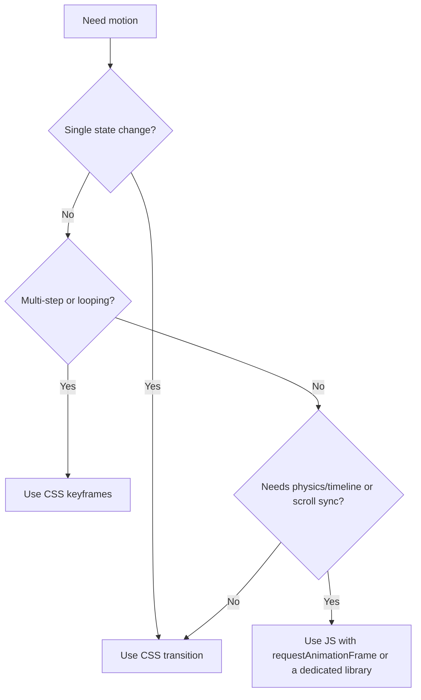

# Animation Workflow

Create intentional, lightweight UI motion that improves clarity without reducing readability or responsiveness.

## When to Use
- Add visual feedback for state changes (success, error, focus, selected).
- Smooth page or section transitions.
- Improve perceived responsiveness for async actions.
- Introduce small delight moments while preserving accessibility.

## Inputs
- Target UI area or component.
- Trigger event (hover, click, route change, loading state, etc.).
- Intended user outcome (attention, hierarchy, feedback, continuity).
- Constraints: device performance, reduced motion requirements, and code ownership boundaries.

## Procedure
1. Define the animation goal in one sentence.
2. Pick the motion strategy using this decision tree.

3. Choose properties that are cheap to animate.
- Prefer `transform` and `opacity`.
- Avoid animating layout-heavy properties (`width`, `height`, `left`, `top`) unless required.

4. Set timing and easing based on intent.
- Micro feedback: 80-160ms.
- Standard transitions: 160-260ms.
- Emphasis transitions: 260-420ms.
- Start with `ease-out` for enter, `ease-in` for exit.

5. Build the motion with project conventions.
- Put reusable motion styles in shared CSS where possible.
- For component-scoped motion, keep styles near the component.
- Reuse existing patterns visible in this repo:
  - `src/components/OutputWord.js` (short state feedback transitions)
  - `src/pages/Home.js` (`requestAnimationFrame` lifecycle handling)
  - `src/styles/keyboard.css` (CSS transition patterns)

6. Add reduced-motion support.
- Include a `prefers-reduced-motion` fallback that disables or simplifies non-essential animation.
- Preserve information hierarchy even when motion is removed.

7. Validate behavior and performance.
- Verify no visual jump or layout shift on animation start/end.
- Ensure animation does not block interaction.
- Check keyboard and screen-reader flows remain usable.

8. Finalize with a short PR summary.
- What animates.
- Why it helps.
- How reduced-motion is handled.
- Any measurable performance observations.

## Decision Rules
- Use no animation when the UI state is already obvious.
- If animation competes with text comprehension, reduce intensity or remove it.
- If animation introduces jank on low-end devices, shorten duration and remove blur/shadow effects.
- If multiple elements animate at once, stagger in small intervals (20-60ms) to reduce visual noise.

## Completion Checklist
- Motion communicates state or hierarchy clearly.
- Timing is consistent with nearby UI behavior.
- Reduced-motion path is implemented and tested.
- No regressions in interaction, focus, or readability.
- No obvious frame drops during interaction.

## Example Prompts
- Add a subtle entry animation to the lesson results panel when a word is accepted.
- Replace abrupt keyboard key state changes with 120ms transform and opacity transitions.
- Create a reduced-motion fallback for the home page hero animation.